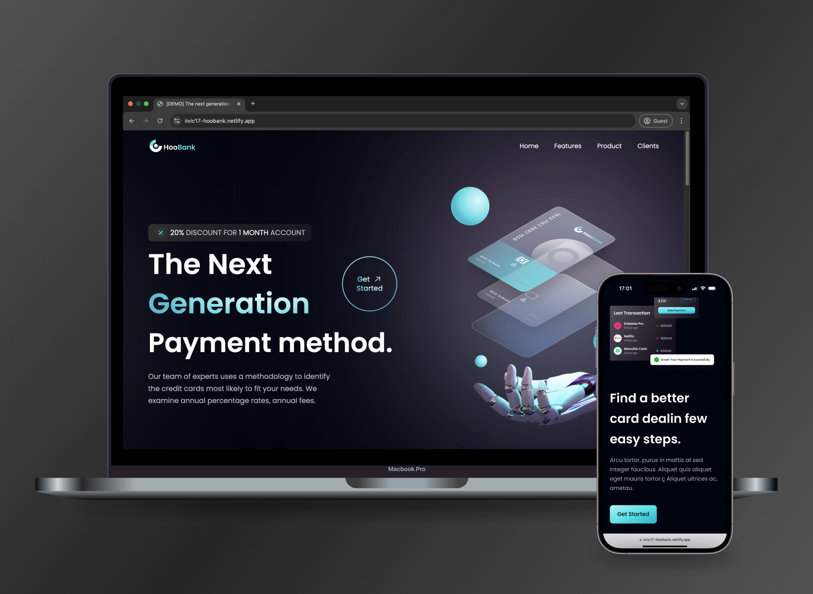

# Hoobank

Hoobank is a fully responsive landing page built with **React** and **Tailwind CSS**, focused on modern UI. It features a stunning hero section, high-quality assets, gradients, and more.

## Features

### 🎨 Modern Design
- Implemented responsive design using **Tailwind CSS** to ensure compatibility across various devices.
- Utilized high-quality assets and gradients to create a visually appealing interface.

### ⚡ Fast Development
- Leveraged **Vite** for a quick development server and optimized production builds.
- Configured **PostCSS** with **Autoprefixer** for efficient CSS processing and cross-browser compatibility.

### 🔄 Dynamic Components
- Built interactive UI components with **React** to enhance user engagement.
- Organized codebase with reusable and maintainable React components.

